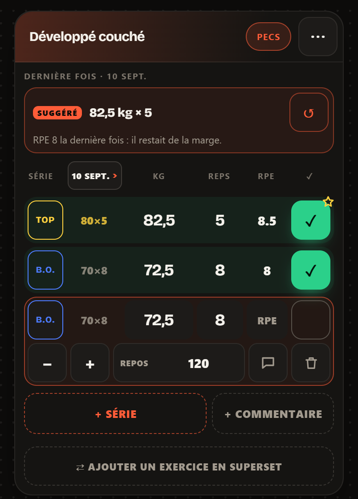

> [English](README.md) · **Français**


# top-set

**Note une série en dix secondes. Regarde ta progression se construire, mois après mois.**

[](https://github.com/flxYom/top-set/actions/workflows/ci.yml)

[](LICENSE)

Un carnet de musculation qui tourne entièrement dans le navigateur. Tu notes tes
séries, tes charges, tes répétitions et ton RPE pendant la séance ; il te rend le
volume, les records et la progression dans le temps.

Le compte est facultatif. Sans lui, tout vit dans le `localStorage` du
navigateur, sur l'appareil que tu utilises, et aucun serveur ne voit rien. Avec
lui, le carnet est en plus copié chez Supabase et te suit d'un appareil à
l'autre, et la messagerie s'ouvre : l'équipe, ton coach, tes coachés. Voir
[Où vivent tes données](#où-vivent-tes-données).

**C'est une bêta**, utilisée et développée au jour le jour par son auteur. Attends-toi
à des aspérités et, de temps en temps, à un changement qui casse quelque chose. Si
un truc est cassé, confus ou manquant, [ouvre une issue](../../issues/new/choose) —
c'est exactement à ça que sert ce repo pour l'instant.

<p align="center">
  
  
  
</p>
<p align="center"><sub>Planning · Saisie d'une série · Récap hebdomadaire — vrais écrans, avec des chiffres de démo pour ces captures.</sub></p>

---

## Sommaire

- [Ce qu'il fait](#ce-quil-fait)
- [Où vivent tes données](#où-vivent-tes-données)
- [Sauvegarde et récupération](#sauvegarde-et-récupération)
- [Migrer un carnet existant](#migrer-un-carnet-existant)
- [La confidentialité par construction](#la-confidentialité-par-construction)
- [Comptes et Supabase](#comptes-et-supabase)
- [Le lien coach ↔ coaché](#le-lien-coach--coaché)
- [Retours et administration](#retours-et-administration)
- [La pile technique](#la-pile-technique)
- [Structure du projet](#structure-du-projet)
- [Le lancer en local](#le-lancer-en-local)
- [Déployer](#déployer)
- [Le référencement](#le-référencement)
- [L'installer sur un téléphone](#linstaller-sur-un-téléphone)
- [Ce qu'il n'est pas](#ce-quil-nest-pas)
- [La suite](#la-suite)
- [Licence](#licence)

---

## Ce qu'il fait

**Planning hebdomadaire.** La ligne de pastilles, c'est ta semaine. Tu choisis un
jour, tu ajoutes des exercices, tu ajoutes des séries. Les flèches changent de
semaine, et le bouton `AUJOURD'HUI` te ramène — il passe en orange dès que tu
t'es éloigné de la semaine en cours.

**Duplication de série.** `+ SÉRIE` recopie la précédente : poids, reps, RPE,
repos. Seul `fait` repart à zéro. Sur cinq séries identiques, tu en saisis une et
tu appuies quatre fois.

**Incréments.** `−` et `+` ajoutent ou retirent 2,5 kg sans ouvrir le clavier.
C'est le geste le plus fréquent entre deux séries : il coûte un appui.

**Au temps : gainage, planche, chaise.** Un exercice tenu se mesure en secondes.
Taper « Planche » ou « Gainage » bascule la série en durée pendant la frappe —
`−` et `+` y valent 5 secondes — et un bouton de la carte bascule n'importe
quel autre exercice. Sous la série, la *difficulté* ressentie de 1 à 10 remplace
les reps en réserve, qui n'ont pas de sens pour une planche. Le record est la
série la plus longue, la fiche de l'exercice trace le meilleur temps séance après
séance, le récap l'affiche en minutes.

La durée vit **dans le champ des reps, écrite avec son unité** : `45 s`. Le champ
est déjà du texte libre, donc la base, la synchro, la sauvegarde et le tableur la
transportent sans qu'aucun format change, et `45 s` se lit tel quel partout. La
difficulté occupe le champ du RPE — c'est ce que le sigle veut dire au départ.
L'unité est obligatoire : `45` tout court reste 45 répétitions. Deviner
réinterpréterait des séances déjà notées, et ce n'est pas à l'app de décider
après coup qu'une série de pompes était un gainage. Une durée ne compte ni dans le
volume, ni dans le 1RM estimé, ni dans les records par reps.

**RPE par série.** Échelle des répétitions en réserve, de 10 à 6 par demi-points :
10 c'est l'échec, 9 il t'en restait une, 8 il t'en restait deux. Facultatif —
laisse vide, rien ne casse.

**Repos par série**, et non par exercice, repris automatiquement à la duplication.

**Mémoire des exercices.** Tape un exercice absent de la base et il est retenu
pour la prochaine fois, groupe musculaire compris. L'enregistrement se fait quand
tu quittes le champ, pas à chaque lettre — sinon tu te retrouverais avec `B`,
`Be`, `Ben`.

**Récap.** Volume total (poids × répétitions, additionné), calendrier des séances,
records par exercice et répartition par groupe musculaire — sur la semaine, le
mois ou l'année.

**Deux rubriques dans SÉANCES.** *Mes séances* — ce qui reste à faire : les
séances préparées mais pas loguées, celle du jour, celles à venir, triées du plus
ancien au plus récent pour qu'une séance sautée remonte. C'est là que vit
*Créer ma séance*. *Historique* — ce qui est fait, du plus récent au plus ancien,
groupé par mois. La frontière est le fait de l'avoir loguée, pas la date seule :
une séance loguée aujourd'hui reste dans *Mes séances* jusqu'au lendemain.

**Graphique de progression** par exercice, tracé depuis ton propre historique.

**Faire un retour.** Un lien en bas de chaque écran ouvre un formulaire : un bug,
une idée, une question. Ça part dans la base, pas dans une boîte mail, et
l'app t'emmène aussitôt dans ta conversation avec l'équipe, où la réponse
arrivera. Il faut un compte — c'est ce qui permet de répondre, et ce qui évite
qu'un robot remplisse la table.

**Messages.** Une bulle dans l'en-tête ouvre toutes les conversations au même
endroit : l'équipe Top Set, son coach, ses coachés. Une pastille y compte ce qui
attend. Voir [La messagerie](#la-messagerie).

**Trois portes dans l'en-tête.** La bulle des messages, la silhouette du
**profil** (compte, pseudo, coach, synchronisation) et `⇅` pour les **données**
(sauvegarde, tableur, import). Le compte et les fichiers vivaient dans la même
feuille, qui était devenue un fourre-tout.

**Pensé pour le téléphone.** Les onglets restent en haut quand on descend —
y compris dans l'app installée sur iPhone, où ils glissaient sous la barre
d'état. Une flèche « revenir en haut » apparaît dès qu'on est descendu d'un
écran. Deux appuis rapides sur `+` ajoutent 5 kg au lieu de zoomer
(`touch-action: manipulation`), et toucher un champ ne fait plus zoomer
Safari : sous iOS, tous les champs sont écrits en 16 px au moins, la taille en
dessous de laquelle Safari zoome d'office — et ne dézoome plus. Cette règle est
**la dernière de la feuille de style** : à spécificité égale, c'est la règle
écrite plus bas qui gagne, et placée plus haut elle perdait contre le champ de
la messagerie, qui restait en 14 px. Un garde-fou le vérifie.

Les feuilles (données, profil, retour) et l'écran d'accueil laissent la place
de l'heure et de la batterie, et leur en-tête — avec la croix — reste en haut
quand on les fait défiler. Dans l'app installée, une feuille haute glissait sa
croix sous la barre d'état : on ne pouvait plus la fermer.

**Une virgule qui marche vraiment.** Le champ poids accepte `62,5` comme `62.5`.
Un clavier français propose une virgule, et `<input type="number">` la refuse en
silence : le champ se vide et la série perd son poids. C'est précisément pour ça
que ce champ est en `type="text"` avec `inputmode="decimal"`.

---

## Où vivent tes données

**Sans compte** — le fonctionnement par défaut — dans le `localStorage`, sur un
appareil, dans un navigateur. Nulle part ailleurs.

**Ce que ça t'apporte :** aucun compte, démarrage immédiat, rien à faire fuiter,
aucun serveur à payer.

**Ce que ça te coûte :** aucune synchronisation entre appareils, et le carnet est
*détruit* si tu vides les données du site, changes de téléphone, ou navigues en
privé.

**Avec un compte**, une copie vit en plus dans Postgres chez Supabase, et le même
carnet s'ouvre sur n'importe quel appareil. Le téléphone garde sa copie dans les
deux cas : le compte ne remplace pas le stockage local, il le sauvegarde.

Onze tables au total. Cinq portent le carnet — `seances`, `exercices`, `series`,
`exercices_perso`, `consentements` — et personne n'y voit jamais la ligne d'un
autre, sauf le coach à qui l'on a ouvert son carnet, en lecture seule. Les autres
sont venues après :

- **`profils`** — pseudo, rôle, date d'inscription, date de dernière visite. Le
  pseudo continue de vivre dans les métadonnées du compte : cette colonne n'en
  est qu'un miroir interrogeable, parce que le schéma `auth` de Supabase n'est
  pas lisible depuis un navigateur. Aucune donnée de carnet, aucun email.
- **`retours`** — les retours utilisateurs. Supprimer son compte n'efface pas le
  retour, ça le rend anonyme (`on delete set null`) : partir est un droit,
  effacer un bug signalé n'en est pas un.
- **`liens_coach`** — qui suit qui, et depuis quand. Voir
  [Le lien coach ↔ coaché](#le-lien-coach--coaché).
- **`messages_support`** et **`messages_coach`** — les deux moitiés de la
  messagerie. Voir [La messagerie](#la-messagerie).
- **`notifications_admin`** — ce que l'équipe doit voir passer, écrit
  uniquement par des déclencheurs.

### Un carnet par compte

Le carnet local vit sous une seule clé, partagée par tout l'appareil. Tant
qu'une personne égale un appareil, ça ne se voit pas. Dès que deux comptes se
connectent sur le même téléphone, le second voyait le carnet du premier — et
l'app lui proposait de l'envoyer sur *son* compte, ce qui en changeait le
propriétaire pour de bon.

La règle est donc&nbsp;: **le carnet suit le compte, pas l'appareil.** À la
connexion, si le carnet présent appartient à un autre identifiant, il est rangé
sous `topset_carnet_<user_id>` et celui du nouvel arrivant est repris s'il en
avait un ici. Le format ne change pas, la clé `musculation_sessions` non plus&nbsp;:
c'est son contenu qui est échangé.

Trois propriétés valent d'être notées&nbsp;:

- **Rien n'est effacé.** Le rangement précède toujours le vidage, et un
  rangement plus riche n'est jamais écrasé par un plus pauvre.
- **La file d'envoi part avec le carnet.** La garder ferait pousser les journées
  d'un compte vers l'autre à la première synchro.
- **Un carnet rangé n'est récupérable que par son propriétaire.** C'est aussi la
  bonne règle de confidentialité&nbsp;: l'autre compte ne doit pas pouvoir le
  reprendre.

La déconnexion applique la même règle. Le commentaire du code disait que
supprimer le carnet à la déconnexion serait une perte de données — c'était vrai
tant qu'il n'existait aucun endroit où le mettre. Maintenant qu'il y en a un, se
déconnecter range le carnet et rend l'app vierge&nbsp;: celui qui ouvre le
téléphone ensuite, même sans compte, ne voit rien.

Une adresse email = un carnet.

### Comment marche la synchro

Le `localStorage` reste la source de vérité de l'interface. Tout est écrit en
local d'abord et immédiatement — l'écran n'attend jamais le réseau. Supabase est
une copie qui suit.

L'unité de synchro est **la journée**, parce que c'est déjà l'unité de l'app :
`state.sessions` est un dictionnaire `date → séance`. `pousser_jour()` réécrit une
journée entière de façon atomique, ce qui supprime les doublons, les fusions
partielles et les séries orphelines en tant que classe de bugs, au lieu de les
traiter cas par cas.

Une modification marque sa journée et l'envoi attend 2,5 s de calme : taper au
clavier ne déclenche pas une requête par frappe. Hors ligne, la file des journées
en attente vit dans le `localStorage` et repart sur l'événement `online` et au
retour sur l'onglet. **Une journée ne quitte la file que si le serveur a
confirmé.**

Clés de stockage : `musculation_sessions` (le carnet), `topset_custom_exercises`
(exercices mémorisés), `topset_sync` (file d'attente et curseur de synchro),
`topset_conflits` (la version perdante d'un conflit, jamais jetée en silence).

---

## Sauvegarde et récupération

Le navigateur étant l'unique copie, l'app prend sa perte au sérieux.

**Export.** Le bouton `⇅` te donne un fichier JSON contenant toutes tes séances et
tes exercices personnels. Tu le télécharges, le partages, ou le copies en texte.
C'est la seule copie qui survit à un navigateur nettoyé.

**Importer ajoute, ne remplace plus.** Remplacer effaçait le carnet en place par
celui du fichier : une vieille sauvegarde importée par erreur faisait disparaître
des mois de séances. `fusionnerCarnets()`, dans `intelligence.js` et donc
testée, ajoute ce qui manque et ne touche jamais à ce qui est là :

- un jour absent arrive entier, avec son titre ;
- dans un jour présent, un exercice est reconnu par son identifiant, ou par son
  nom et ses séries remplies — c'est ce qui permet au tableur, qui n'a pas
  d'identifiants, de ne rien doubler ;
- c'est un multi-ensemble, pas un ensemble : deux cartes « Pompes × 20 » le même
  jour sont deux exercices faits, et restent deux ;
- un identifiant déjà pris ailleurs dans le carnet est remplacé. En base, un
  exercice est unique par personne, tous jours confondus : un doublon bloquerait
  la synchro de la journée pour toujours.

Le premier appui montre ce qui va arriver — « 25 séries sur 4 jours (dont 3 que
tu n'avais pas) » — le second applique, en refaisant la fusion sur le carnet de
cet instant. Seules les journées qui ont bougé repartent vers le compte.
Réimporter deux fois le même fichier n'ajoute rien.

**Le tableur se réimporte.** `lireCsvCarnet()` relit le CSV exporté, et ce
qu'Excel en fait quand il le réenregistre : virgules au lieu de points-virgules,
dates en JJ/MM/AAAA. Il passe ensuite par exactement le même nettoyage qu'un
fichier JSON. Au passage, l'import relit enfin le **titre** des séances : il
voyageait dans la sauvegarde sans jamais être relu.

**Garde-fou contre l'écrasement.** `saveLocal()` réécrit le carnet entier à chaque
sauvegarde. Si `state.sessions` était vide au mauvais moment — chargement raté,
JSON corrompu — cet unique appel effacerait tout, définitivement et sans un mot.
Donc :

- L'app **refuse** de remplacer un carnet rempli par un carnet vide, et le dit.
  La condition se lève d'elle-même dès qu'il y a de nouveau un jour réel.
- Chaque sauvegarde conserve la **version précédente** sous une clé de secours.
- Un JSON illisible est **mis de côté** au lieu d'être écrasé.
- Un bouton `RÉCUPÉRER N JOURS` apparaît dans le panneau `⇅` dès qu'une copie
  récupérable contient plus que ce qui est chargé. Récupérer, c'est importer
  cette copie : ce qui manque revient, ce qui est là ne bouge pas.

---

## Migrer un carnet existant

Quelqu'un qui utilisait l'app en local et crée ensuite un compte se voit poser la
question — jamais de migration automatique, parce que l'appareil a pu servir à
quelqu'un d'autre.

```
données locales → détection → migration proposée → envoi → vérification
```

La migration est **non destructive par construction** : le local est le cache de
l'app, donc rien n'y est jamais effacé — c'est une propriété de la conception, pas
une promesse. Quand une journée existe des deux côtés, la plus fournie gagne et
l'autre est mise de côté dans `topset_conflits`.

Elle est **idempotente** : pousser deux fois la même journée produit les mêmes
lignes, parce qu'une journée est remplacée en entier et non complétée.

Elle ne se déclare réussie qu'après avoir relu le cloud et compté les séries une à
une. Sans cette étape, « migré » ne voudrait dire que « aucune requête n'a renvoyé
d'erreur ».

---

## La confidentialité par construction

Ce que la politique de confidentialité affirme est **appliqué techniquement**, pas
seulement écrit :

**Aucune requête vers un tiers.** Bricolage Grotesque, Chart.js et supabase-js
sont tous servis depuis le site lui-même. Les charger depuis un CDN enverrait
l'adresse IP de chaque visiteur à Google ou Cloudflare à chaque ouverture, qu'il
ait un compte ou non.

**Un CSP strict** dans `vercel.json` — `default-src 'self'`, `script-src 'self'`
sans `'unsafe-inline'`, `object-src 'none'`, `frame-ancestors 'none'`, et
`connect-src` limité à `'self'` plus la seule origine Supabase du projet. Rien
d'autre ne peut être contacté, ce qui bloque l'exfiltration au niveau du
navigateur, et aucun script injecté ne peut s'exécuter même si un `esc()` était
oublié quelque part.

**Un fichier importé est traité comme hostile.** Il est plafonné à 8 Mo avant
d'être lu, les identifiants qui sortent de `[A-Za-z0-9_-]{1,64}` sont remplacés,
le groupe musculaire est validé contre la liste fermée, et les exercices
mémorisés sont repassés clé par clé. Aucune donnée légitime n'est réécrite :
`test/gabarits.test.mjs` vérifie que les identifiants historiques passent tous
le filtre.

**Rien n'est téléchargé pour qui n'a pas de compte.** supabase-js pèse 209 Ko et
n'est chargé que si une session existe déjà, ou au moment où l'on se connecte.

**Row Level Security sur toutes les tables.** Chaque ligne porte l'identifiant de
son propriétaire, et la base refuse toute lecture ou écriture qui ne correspond
pas à l'utilisateur connecté. Les clés étrangères sont composites
`(user_id, id)` : une ligne ne peut même pas structurellement appartenir à la
séance de quelqu'un d'autre. Le client n'envoie jamais de `user_id` — il vient du
jeton, côté serveur.

**Deux couches de droits, pas une.** Supabase accorde par défaut tous les droits
de table au rôle `authenticated` sur chaque table créée. Le schéma les révoque
puis n'accorde que ce qui sert : un consentement et un retour peuvent être écrits
et relus, jamais modifiés ni effacés. RLS le garantissait déjà ; le droit de table
le redit, pour que la garantie ne tienne pas sur une seule couche.

**Aucune policy `UPDATE` sur `profils`, et c'est délibéré.** RLS filtre des
lignes, pas des colonnes : « chacun modifie son profil » aurait aussi autorisé
`update profils set role = 'admin' where user_id = auth.uid()`. La ligne
appartient bien à l'appelant, la policy passerait, et n'importe qui deviendrait
administrateur depuis la console de son navigateur. Tout passe par
`toucher_profil()`.

**Aucun cookie, aucune mesure d'audience, aucun traceur.** Sans compte, le seul
traitement qui existe, ce sont les journaux d'accès de l'hébergeur.

**La politique de confidentialité suit l'app.** La version 3.0 dit, fonction par
fonction, ce qu'un compte enregistre, qui le voit — soi, son coach, l'équipe —,
sur quelle base légale et pour combien de temps. La version acceptée est
enregistrée avec chaque consentement : à l'inscription, et à chaque demande de
coaching. Cette dernière partait sans numéro, et la base inscrivait « 1 », une
version qui n'a jamais existé. La 3.0 ne redemande rien aux comptes existants :
elle décrit ce que les gens déclenchent eux-mêmes (écrire, envoyer un retour) et
le coaching, qui a déjà son propre accord.

---

## Le lien coach ↔ coaché

C'est la seule ouverture du mur des carnets, et elle tient en quatre policies
`SELECT` ajoutées **à côté** des policies existantes, sans les toucher : deux
policies permissives se cumulent, donc le propriétaire garde tous ses droits et
le coach n'obtient que la lecture.

**Le lien n'existe que si les deux parties ont agi.** Le coach génère un code de
8 caractères (alphabet sans `O`/`0` ni `I`/`1` — il se lit à voix haute), le
coaché le saisit, le coach accepte. Un pseudo tapé à la main donnerait un carnet
entier à un inconnu sur une faute de frappe ; un code est faux ou juste, jamais
« presque ».

**Ce que le coach peut :** lire les séances, exercices, séries et exercices
mémorisés de son coaché, et voir son pseudo.
**Ce qu'il ne peut pas :** modifier ou effacer quoi que ce soit, voir l'email,
les consentements ou les retours. Il n'existe aucune fonction pour.

**Un seul coach actif** par personne, garanti par un index unique partiel et non
par une règle applicative qu'on pourrait oublier. **Révocable des deux côtés**,
avec effet immédiat : la policy relit le statut à chaque requête, il n'y a ni
jeton à expirer ni cache à vider. Le **consentement** du coaché est daté et
versionné dans `consentements` au moment où il fait la demande.

### Le point de conception qui compte

`tirer_jours_de(client)` est en `security invoker` et **ne vérifie aucun droit**.
Elle demande les séances de ce client, et RLS répond. Sans lien actif le résultat
est vide — pas parce qu'un `if` l'a décidé, mais parce que la base n'a rien à
montrer. Il n'y a donc aucun contrôle à oublier dans cette fonction, et un test
vérifie qu'elle ne passe jamais en `security definer`.

47 tests couvrent ce seul mécanisme : avant lien, en attente, après accord, ce
que le coach ne peut pas faire, le tiers qui n'est ni l'un ni l'autre, le second
coach refusé, la révocation, l'arrêt du coaching, et `anon` partout.

### La conversation coach ↔ coaché

Une table à part, `messages_coach`, et non une réutilisation de la messagerie de
support : là-bas l'autre partie est « l'administration », la même pour tout le
monde ; ici ce sont deux comptes, et le droit d'écrire se lit **dans le lien**,
pas dans un rôle.

- **Écrire** exige le lien *actif*, et que l'auteur déclaré corresponde au côté
  réel : un coaché ne signe pas « coach », un coach n'écrit pas à quelqu'un qu'il
  ne suit pas, et personne ne fabrique un fil entre deux inconnus.
- **Lire** : le coaché garde son historique même après avoir coupé l'accès —
  c'est sa conversation. Le coach, lui, perd la lecture dès la rupture, comme
  pour le carnet. L'administrateur ne la voit pas.
- **Réécrire** est impossible : le droit de mise à jour est limité à la colonne
  `lu`. **Effacer** aussi : il n'y a pas de policy `delete`.

Dans l'app, cette conversation est une ligne de la boîte des messages, comme
les autres. On y arrive aussi depuis *Mon coach* dans le profil, depuis chaque
carte de *Mes coachés*, et depuis le carnet que le coach est en train de lire —
lire une séance et vouloir en parler, c'est le même geste. Un suivi terminé
reste dans la boîte du coaché, marqué **SUIVI TERMINÉ** : il la relit, il n'y
écrit plus.

---

## Retours et administration

### Les retours

Un lien « Nous faire un retour » en pied de page ouvre une feuille : trois
natures — `bug`, `idee`, `question` — un texte de 4 000 caractères maximum, et la
liste de ce qu'on a déjà envoyé avec son statut.

Ce qui part avec le message : la vue où l'on se trouvait, la taille de l'écran,
le navigateur tronqué à 160 caractères, et un drapeau « installé en PWA ». De quoi
reproduire un bug, et rien du carnet. L'écran le dit avant l'envoi.

Les bornes sont dans la base, pas dans le formulaire : `check` sur le type, sur
le statut, sur la longueur du corps et sur la taille du contexte. On ne défend pas
une table avec du JavaScript.

### La messagerie

Un fil par personne, le même des deux côtés : un message écrit par
l'administrateur porte quand même le `user_id` du membre, sans quoi il n'y
aurait pas de conversation mais deux listes.

Le point qui tient tout : **la policy d'insertion vérifie que l'auteur déclaré
correspond au rôle réel de l'appelant.** Un membre ne peut pas insérer un
message signé `admin`, même en fabriquant la requête à la main. Ce n'est pas le
formulaire qui l'empêche, c'est la base.

Le droit d'écriture est limité à la colonne `lu` — encore la même leçon : RLS
filtre des lignes, pas des colonnes, et sans ce droit restreint la policy
`update` laisserait réécrire le corps d'un message déjà envoyé.

#### Une seule boîte pour toutes les conversations

Le support et le coaching avaient chacun leur fil, dans deux feuilles
différentes, et un ticket arrivait dans l'espace admin sans rien pour y
répondre. Il y a désormais **une boîte**, derrière la bulle de l'en-tête. Deux
tables en base, parce que le droit d'écrire ne s'y décide pas pareil — un rôle
d'un côté, un lien de l'autre — mais une seule porte à l'écran : pour la
personne, c'est la même chose, quelqu'un lui a écrit.

Une conversation se décrit par sa table, le côté où l'on se tient et l'autre
personne. Quatre points de vue, un seul rendu :

| Qui regarde | Table | Avec qui |
|---|---|---|
| un membre | `messages_support` | l'équipe Top Set |
| l'équipe | `messages_support` | chaque membre qui a écrit |
| un coaché | `messages_coach` | son coach |
| un coach | `messages_coach` | chacun de ses coachés |

Un coach ou un coaché écrit à l'équipe comme n'importe quel membre, et l'équipe
peut écrire à n'importe qui depuis l'espace admin (**ÉCRIRE**, **RÉPONDRE**).
**Deux inconnus ne peuvent pas s'écrire** : aucun lien ne dit que l'un veut bien
lire l'autre, et c'est la base qui refuse, pas l'écran.

La boîte ne demande aucune fonction nouvelle en base : le dernier message et les
non-lus se lisent directement, sous RLS, et les personnes sans message encore
viennent des liens de coaching. La conversation est la page elle-même — le
champ de saisie reste collé en bas de l'écran — et les nouveaux messages sont
relevés toutes les dix secondes tant qu'elle est ouverte et visible, toutes les
trente secondes dans la boîte. Rien quand l'onglet est caché : ce n'est pas un
battement de cœur pour garder la base éveillée.

#### Ce qui en fait une conversation et pas un formulaire

Le fil s'ouvre **même vide**. Ça paraît un détail d'affichage ; c'en était un de
fonctionnement. Tant qu'il se cachait faute de messages, personne ne pouvait
écrire le premier : la conversation ne pouvait commencer que si elle avait déjà
commencé. Un fil vide affiche maintenant une invitation, et la zone de saisie
avec.

Le reste tient en quatre gestes, tous empruntés à ce que fait n'importe quelle
messagerie et qu'on ne remarque que par leur absence :

- **Les bulles s'alignent par auteur** — les siennes à droite, en orange,
  celles d'en face à gauche. Sans ça il faut relire l'étiquette à chaque bulle
  pour savoir qui parle. Le jour s'écrit une fois, en intertitre (« Hier »,
  « Aujourd'hui »), et chaque bulle ne porte que l'heure.
- **Le nom ne s'affiche qu'au-dessus de ce que dit l'autre.** Au-dessus des
  siens il n'apprend rien et double la hauteur du fil.
- **Une bulle d'attente** apparaît quand le dernier message est du membre. Elle
  n'est pas stockée : elle est fabriquée à l'affichage et disparaît d'elle-même
  dès qu'une réponse arrive, puisqu'alors le dernier message n'est plus de lui.
- **Entrée envoie, Maj+Entrée va à la ligne**, des deux côtés. Le bouton reste
  pour le téléphone.

À l'ouverture, la page descend jusqu'au dernier message. Une relève qui apporte
du neuf ne fait descendre que si l'on était déjà en bas — on ne tire pas la page
sous le nez de quelqu'un qui relit plus haut — et une relève sans nouveauté ne
repeint rien. L'animation est coupée pour qui a réglé son système sur
`prefers-reduced-motion`.

#### Un retour ouvre la conversation

Un retour arrivait dans l'espace admin sans rien qui permette d'y répondre, et
de son côté le membre ne voyait rien se passer. Désormais un déclencheur,
`accuser_retour()`, recopie le retour dans le fil du membre — signé de lui,
marqué d'une étiquette **RETOUR** — puis ajoute un accusé de réception.

Cet accusé est signé `systeme`, pas `admin`. Personne n'a encore lu le retour
à ce moment-là ; le signer « admin » serait un mensonge poli. Aucune policy
n'autorise quiconque à écrire un message `systeme`, administrateur compris :
seul le déclencheur le peut, et c'est ce qui le rend crédible. Les deux lignes
sont horodatées explicitement — dans une même transaction `now()` ne bouge
pas, et l'accusé aurait pu s'afficher avant la question.

**Un geste, une notification** : la copie ne se notifie pas, le retour a déjà la
sienne. Et le droit d'insertion est limité aux colonnes `user_id`, `auteur`,
`corps` — sans ça, un membre pourrait poser lui-même un `retour_id` pour faire
taire la notification de ses propres messages.

Côté administrateur, chaque retour porte un bouton **RÉPONDRE** et chaque
inscrit un bouton **ÉCRIRE** : on peut ouvrir une conversation avec n'importe
qui, même avec quelqu'un qui n'a jamais rien envoyé.

Répondre à un retour encore nouveau le passe en **LU**, puisque c'est ce qu'on
vient de faire. Les retours envoyés avant l'accusé de réception n'avaient jamais
ouvert de conversation : le schéma les recopie une fois, à leur date, sans
notification et sans accusé tardif.

Enfin la **pastille** de la bulle, dans l'en-tête, compte tout ce qui attend,
toutes conversations confondues. Deux comptages `head:true` — des nombres, pas
des centaines de messages — au plus une fois toutes les huit secondes, et zéro
en cas d'erreur : une pastille ne doit jamais empêcher une page de s'afficher.
L'équipe compte ce que les membres ont écrit ; un membre compte ce qu'on lui a
écrit ; tout le monde ajoute ses conversations de coaching.

### Les notifications

Une table sans **aucune** policy d'insertion : personne ne peut en fabriquer une
depuis le navigateur. Elles sont écrites par des déclencheurs `security definer`
posés sur `profils`, `messages_support`, `retours` et `liens_coach`.

Ces déclencheurs ne lisent aucun paramètre venu du client : ce qu'ils
inscrivent, ils le prennent dans la ligne qui vient d'être écrite. C'est la
version base de données de « relire la source plutôt que croire le corps de la
requête » — la règle qu'on applique côté serveur ailleurs, obtenue ici sans
serveur.

**Elles partent avec le compte.** Elles étaient en `on delete set null`, pour
garder la trace de ce qui s'était passé sans que la personne soit
identifiable. Mais une notification porte le pseudo (inscription) ou les 200
premiers caractères d'un message : orpheline, elle l'était encore. Elles sont
désormais en cascade, et le schéma efface celles qui étaient déjà orphelines.
Seuls les retours survivent à un compte supprimé — sans auteur, et sans
notification qui le nomme.

### L'espace administrateur

Réservé au rôle `admin`. Il montre dix compteurs (inscrits, nouveaux et actifs à
7 et 30 jours, séances, séries, retours en attente, messages non lus,
notifications), les notifications, un accès à la boîte des messages, la liste
des retours — chacun avec **RÉPONDRE**, **MARQUER LU** et **TRAITÉ** — et la
liste des inscrits triée par dernière visite, chacun avec **ÉCRIRE**.

**Ce qu'il ne montre pas :** aucun email, et aucune ligne de carnet. Les quatre
fonctions renvoient des agrégats. Un administrateur voit *combien* de séances sont
loguées, jamais ce qu'il y a dedans — le `select` direct sur `seances` lui est
refusé comme à tout le monde, et un test le vérifie à chaque exécution de la
suite.

Le contrôle du rôle est **dans les fonctions**, en première instruction, pas dans
l'interface : cacher un bouton n'a jamais protégé personne.

### Se nommer administrateur

Il n'existe aucune fonction pour ça, volontairement. Ça se fait une fois à la
main, après avoir ouvert l'app au moins une fois pour que la ligne de profil
existe — Supabase → SQL Editor :

```sql
update public.profils set role = 'admin'
where user_id = (select id from auth.users where email = 'ton@email.fr');
```

---

## La pile technique

Aucun framework. Aucune étape de build. Aucun bundler. Aucune dépendance à
installer.

Un fichier HTML avec le CSS en ligne, plus des fichiers statiques.
`index.html` pèse environ 204 Ko, dont à peu près 119 Ko de texture en base64 ;
le JavaScript de l'app vit à côté, dans `app.js` (237 Ko), et la logique métier
testée dans `intelligence.js` (31 Ko).

**Pourquoi le JS n'est pas en ligne, lui.** Il l'a été jusqu'à l'audit de
sécurité. Un script en ligne oblige à écrire `script-src 'self' 'unsafe-inline'`
dans la politique de sécurité de contenu — et cette permission-là autorise aussi
les gestionnaires d'événements injectés. Un XSS trouvé pendant cet audit
s'exécutait précisément grâce à elle. Sans étape de build, il n'existe pas de
`nonce` possible sur un hébergement statique : sortir le script est la seule
façon de passer à `script-src 'self'`. Il est chargé à la même place, en fin de
`<body>`, donc l'ordre d'exécution ne change pas.

`style-src` garde `'unsafe-inline'`, et c'est assumé : les cartes portent un
attribut `style="--card-color:…"`, une injection de style ne peut pas exécuter
de script, et sortir la feuille de style ne supprimerait pas le besoin.

Deux bibliothèques, chacune chargée seulement quand elle sert : Chart.js 4.4.1 la
première fois qu'on ouvre un graphique de progression, supabase-js 2.115.0 quand
un compte entre en jeu.

C'est un choix assumé pour une app de cette taille : aucune chaîne d'outils à
maintenir, aucune dérive de versions, et l'ensemble s'ouvre, se lit et se modifie
dans un seul fichier.

---

## Structure du projet

```
index.html               balisage et styles de l'app
app.js                   toute la logique de l'app (sortie du HTML pour la CSP)
intelligence.js          logique métier pure : top set, records, 1RM, signaux
sw.js                    service worker — coquille en cache, hors-ligne
guide.html               page « comment ça marche »
cgu.html                 conditions générales d'utilisation
confidentialite.html     politique de confidentialité
mentions-legales.html    mentions légales
legal.css                styles communs aux pages ci-dessus
chart.umd.js             Chart.js 4.4.1, chargé à la demande
fonts/                   Bricolage Grotesque, auto-hébergée (latin + latin-ext)
screenshots/             captures utilisées dans ce README (planning, saisie, récap)
icon.svg                 favicon principal
favicon-16/32/48.png     secours là où les favicons SVG ne passent pas ; 48 px
                         est la taille que Google demande pour ses résultats
favicon.ico              16 + 32 + 48 px, pour les navigateurs qui le demandent d'office
icon-180/192/512.png     écran d'accueil et PWA
og-image.png             aperçu de partage, 1200×630
manifest.webmanifest     manifeste PWA
vercel.json              en-têtes de sécurité et politique de cache
robots.txt               indexation
sitemap.xml              plan du site, produit par scripts/contenu.mjs
carnet-de-musculation.html  page produit (générée)
methode-editoriale.html  qui écrit, sources, IA, relecture (générée)
apprendre.html           la rubrique principale : toutes les rubriques et leurs pages (générée)
documentation/  entrainement/  exercices/  outils/
                         pages de contenu et leurs rubriques (générées, commitées)
404.html                 page d'erreur (générée, non indexée)
contenu.css              styles des pages de contenu
outils/outils.js         calculateurs (fichier externe : la CSP refuse le script en ligne)
img/                     captures de l'app pour la page produit (WebP)
supabase.umd.js          supabase-js 2.115.0, chargé à la demande
supabase-config.js       URL du projet + clé publique (voir Comptes)
supabase/schema.sql      tables, politiques RLS et fonctions de synchro
supabase/test/           le schéma testé sur un vrai Postgres (PGlite) : RLS (233),
                         montée depuis chaque version passée (11)
test/                    logique métier (146), gardes de sécurité (167), liens (75), gabarits de contenu (15)
LICENSE  SECURITY.md  CONTRIBUTING.md  CHANGELOG.md
.github/                 modèles d'issues, workflow de CI
.vercelignore            ce que le site ne publie pas : docs, schéma, tests, source du contenu
docs/seo/                stratégie SEO et contenu : matrice des sujets, recherche, inventaire
contenu/                 source des pages de contenu, bibliographie, rubriques (non publié)
scripts/                 générateur des pages de contenu et son gabarit (non publié)
```

Les icônes et l'image de partage sont générées à partir de leur géométrie par un
script plutôt que dessinées à la main : changer une couleur de marque, c'est
changer une valeur et relancer. Ce script vit hors du dépôt, avec les sources du
logo.

Tout ce qui est dans le dépôt n'est pas une page du site : `.vercelignore` écarte
la documentation, le schéma, les tests, et la source des pages de contenu
(`contenu/`, `scripts/`) dont seules les pages produites sont servies. Avant, `top-set.fr/supabase/schema.sql`
était lisible par n'importe qui — rien de secret, la sécurité tient à RLS et pas
au secret du schéma, mais rien à servir non plus.

---

## Comptes et Supabase

Les comptes sont **facultatifs**. Sans `supabase-config.js` — ou avec
`window.TOPSET_SUPABASE` à `null` — le profil dit que les comptes ne sont pas
disponibles, la bulle des messages disparaît, et l'app est un carnet purement
local. Rien ne casse, aucun bouton mort.

Il n'y a **ni étape de build ni variable d'environnement à l'exécution** : un site
statique n'a pas de serveur pour les lire. Les deux valeurs vivent dans
`supabase-config.js`, versionné dans ce dépôt, et c'est correct — les deux sont
publiques par conception :

```js
window.TOPSET_SUPABASE = {
  url:     'https://<ref-du-projet>.supabase.co',
  anonKey: '<la clé anon / publishable>'
};
```

La clé anon identifie le projet, elle ne donne pas d'accès : chaque requête est
filtrée par le Row Level Security sur l'utilisateur connecté. Ce qui ne doit
**jamais** figurer ici, ni nulle part dans Git : la clé `service_role` (ou
`secret`), qui contourne RLS, et le mot de passe de la base.

### Configurer son propre projet

1. **supabase.com/dashboard → New project.** Choisis une région proche de tes
   utilisateurs.
2. **SQL Editor → New query** → colle [`supabase/schema.sql`](supabase/schema.sql)
   → Run. Le script est idempotent : le relancer ne change rien et n'efface rien.
3. **Authentication → Sign In / Providers → Email** : active le provider. Laisse
   *Confirm email* désactivé tant que l'envoyeur par défaut de Supabase est en
   place — il envoie 2 messages par heure, ce qui bloquerait les inscriptions.
   Réactive-le une fois un vrai SMTP configuré.
4. **Project Settings → API** : recopie l'URL du projet et la clé anon dans
   `supabase-config.js`.
5. Ajoute ton origine Supabase au `connect-src` de `vercel.json`, sinon le CSP
   bloque toutes les requêtes — en silence, comme le fait un CSP.

### Tester le schéma

Les règles de la base sont testées contre un vrai Postgres (PGlite), pas simulées :

```bash
cd supabase/test && npm install && npm test
```

`test-rls.mjs` attaque les règles depuis le rôle `authenticated`, comme le
ferait le navigateur : écriture, journée rejouée sans doublon, isolation entre
utilisateurs, lien coach, messagerie, notifications, visiteur anonyme, cascade à
la suppression du compte.

`test-montee.mjs` installe **chaque version passée** du schéma sur une base
neuve, y met des données, puis passe la version actuelle deux fois. La base de
production n'est jamais vide, et c'est là que ça casse : une fonction dont les
colonnes de retour changent passe sur une base neuve, et Postgres refuse de la
« remplacer » sur la vraie. Dans l'éditeur SQL de Supabase, cette seule erreur
annule tout le script, sans que rien ne le dise. C'est arrivé une fois ; les
fonctions qui renvoient un tableau sont désormais supprimées avant d'être
recréées, et ce test tourne dans la CI avec l'historique complet.

---

## Le lancer en local

N'importe quel serveur de fichiers statiques. Il n'y a rien à compiler.

```bash
npx serve .
```

Ouvrir `index.html` directement fonctionne aussi — la seule chose qui casse en
`file://`, c'est le manifeste PWA.

---

## Déployer

Conçu pour de l'hébergement statique. Sur Vercel : importer le dépôt, choisir
**Other** comme framework, déployer. `vercel.json` s'occupe des en-têtes et du
cache, `.vercelignore` de ce qui ne doit pas être publié.

Le site vit sur `top-set.fr`, qui redirige vers `www.top-set.fr`. Le domaine est
écrit en dur dans les balises Open Graph, les liens canoniques, `robots.txt` et
`sitemap.xml` ; le script qui le remplaçait partout a servi une fois, au passage
du domaine provisoire au vrai, et a été retiré.

**À chaque mise en ligne qui touche l'app**, la version du service worker
(`VERSION` dans `sw.js`) avance d'un cran : c'est ce qui dit aux téléphones de
remplacer la coquille gardée en cache.

---

## Le référencement

Ce que le code peut faire est fait :

- un **titre** qui dit ce qu'est l'app — « Top Set — carnet de musculation
  gratuit » — et pas seulement son nom. « Top Set » tout court est aussi le nom
  d'une méthode d'entraînement : les forums qui en parlent passent devant ;
- une **description** de moins de 160 caractères, la longueur au-delà de
  laquelle Google coupe ;
- le **nom du site** déclaré en données structurées (`WebSite`), pour que Google
  affiche « Top Set » au-dessus du résultat plutôt que l'adresse ;
- un **favicon** de 48 px et un `favicon.ico`, générés comme les autres icônes ;
- `robots.txt`, qui autorise tout et indique le plan du site, et
  `sitemap.xml`, qui liste les pages indexables avec leur date de mise à jour —
  il est produit par le générateur des pages de contenu ;
- un lien canonique par page, et `top-set.fr` qui redirige vers
  `www.top-set.fr` : une seule adresse par page, pas de contenu en double.

`test/gabarits.test.mjs` vérifie la longueur du titre et de la description, le
bloc `WebSite`, le favicon et le plan du site.

**La stratégie de contenu** vit dans [`docs/seo/content-strategy.md`](docs/seo/content-strategy.md) :
l'audit, les clusters et leurs pages piliers, la méthode de notation, les 20 sujets retenus, l'architecture
technique, les risques et la boucle Search Console. La matrice (`docs/seo/sujets.json`, 83 sujets)
est la source de vérité ; `node docs/seo/matrice.mjs` en déduit les notes et régénère la matrice classée
et l'inventaire, et refuse deux pages qui viseraient la même URL ou la même requête. Les données de
recherche sont versionnées et datées dans `docs/seo/recherche/` : suggestions de Google, concurrence,
nombre de revues PubMed par thème, mesure Lighthouse. Aucun volume de recherche n'y est inventé.

Le reste ne se fait pas dans le code. Tant que le domaine n'a pas été déclaré
dans **Google Search Console**, Google ne le découvre que par hasard, par un lien
venu d'ailleurs. La déclaration se fait une fois, par un enregistrement DNS chez
OVH, puis on y soumet `https://www.top-set.fr/sitemap.xml`. L'indexation prend
ensuite quelques jours à quelques semaines. Se classer sur « carnet de
musculation » demande autre chose que des balises : du temps, des liens venus
d'autres sites, et des pages qui répondent à ce que les gens cherchent : c'est
le rôle des pages de contenu.

### Les pages de contenu

Le site ne se résume plus à l'app. À côté d'elle, des pages statiques
répondent à de vraies recherches : une notion par page dans `/documentation`,
des guides dans `/entrainement`, des exercices dans `/exercices`, des
calculateurs dans `/outils`, plus une page produit (`/carnet-de-musculation`)
et une page qui dit comment elles sont faites (`/methode-editoriale`). Tout est
regroupé sous une rubrique principale, **Apprendre** (`/apprendre`), qui liste
chaque rubrique et chacune de ses pages.

Dans l'app, Apprendre est un **quatrième onglet**, à côté de PLANNING, SÉANCES
et RÉCAP : un écran fixe de six cartes (documentation, entraînement, exercices,
outils, le carnet, la méthode) et un bouton vers `/apprendre`. Il n'enregistre
rien et ne calcule rien — la vue courante n'est pas stockée, et le rendu
s'arrête là au lieu de retomber sur le récap. Sur les pages, une barre reprend
ces rubriques sous l'en-tête, avec la rubrique courante allumée comme un onglet
de l'app, et le fil d'Ariane passe par Apprendre. Le service worker n'a pas
changé : chaque page visitée reste lisible hors ligne, comme le guide.

Pages publiées : le top set, le calculateur de 1RM, la page produit, le carnet
de musculation pour l'EPS, la planche ; puis, par lots de trois, l'échelle RPE,
le RIR et l'échec musculaire.

**Comment elles sont fabriquées.** Toujours pas de framework ni d'étape de
construction chez Vercel. Chaque page a sa source dans `contenu/` : un fichier
HTML dont le premier commentaire porte les métadonnées en JSON (titre,
description, requête visée, dates, points clés, pages liées, ce que chaque source
soutient). `node scripts/contenu.mjs` en fait les pages publiées, les rubriques,
la 404 et `sitemap.xml` ; les pages produites sont commitées, et le diff d'une
page se relit comme du texte. Deux conventions dans le corps :

- `[[/outils/calculateur-1rm|le calculateur]]` — un lien interne, vérifié ;
- `[@helms2018stop]` — un appel de source numéroté, relié à
  `contenu/sources.json`.

Le gabarit (`scripts/gabarit.mjs`) écrit ce qu'une page ne doit pas pouvoir
oublier : title, description, canonical, Open Graph, fil d'Ariane, signature,
sommaire, sources numérotées et le JSON-LD — `BreadcrumbList` partout,
`Article` sur les définitions, guides et exercices, `SoftwareApplication` sur la
page produit seulement, jamais de `FAQPage`.

**Ce que chaque type de page contient.** Le générateur connaît le gabarit de
chaque type, et refuse une page qui en oublie une partie :

- une **définition** a ses sections « ce que c'est », « comment s'en servir »,
  « exemples » et « erreurs fréquentes », repérées par l'identifiant de leur
  titre (`<h2 id="erreurs">` ; le titre lui-même reste libre), et au moins trois
  **termes associés** dans son champ `termes`. Un terme dont le sujet est publié
  dans la matrice devient un lien vers sa page, tout seul, le jour où elle
  paraît ;
- un **exercice** a sa **fiche** (muscles, matériel, niveau, mouvement,
  respiration), affichée avant le sommaire et dont les sources sont numérotées
  comme le reste ; ses sections « position et exécution », « erreurs
  fréquentes » et « variantes » ; au moins une notion liée, et un autre exercice
  lié dès qu'il en existe un.

« À lire ensuite » affiche la rubrique de chaque page liée. `test/contenu.test.mjs`
retire ces éléments à une copie du site et vérifie que le générateur refuse bien,
en disant ce qui manque.

**Ce que le générateur refuse** (et la CI avec lui, `--verifier`) : une source
citée qui n'est pas dans la bibliographie, ou citée sans dire ce qu'elle soutient
ici ; un lien vers une page qui n'existe pas ; un titre de plus de 60 caractères,
une description hors de 110 à 160, un titre ou une description en double avec une
autre page du site ; une page qui dépasse 30 Ko compressés (la feuille de style,
8 Ko) ; un script ou un style en ligne ; une page dont le sujet n'est pas
`PUBLISHED` dans la matrice, ou qui ne vise pas la même requête qu'elle ; un
fichier généré qui n'est plus à jour. Une rubrique n'est indexable qu'à partir de
trois pages : en dessous, elle existe mais reste hors du plan du site.

**Les sources.** `contenu/sources.json` ne contient que des sources réellement
ouvertes : DOI vérifié sur Crossref, résumé lu sur PubMed, texte intégral quand il
est libre, texte officiel pour l'EPS. Le champ `lu` dit ce qui a été lu, et la
page l'affiche.

**La signature.** « Par Yom Industry × Claude (Anthropic) » : l'aide de l'IA est
dite en toutes lettres, et `/methode-editoriale` explique ce qu'elle fait et ne
fait pas. Dans les données structurées, l'auteur est Yom Industry, l'éditeur. La
mention « relu par Yom Industry le … » n'apparaît que quand le champ `relu` est
rempli dans la source de la page.

**Ajouter une page** : écrire `contenu/<rubrique>/<page>.html`, ajouter ses
sources à `contenu/sources.json`, passer son sujet à `PUBLISHED` avec
`last_review` dans `docs/seo/sujets.json`, puis :

```bash
node scripts/contenu.mjs
```

```bash
node docs/seo/matrice.mjs
```

---

## L'installer sur un téléphone

C'est une PWA : elle s'installe sans passer par un store, obtient son icône et
s'ouvre en plein écran.

**iPhone (Safari)** — Partager, puis *Sur l'écran d'accueil*.
**Android (Chrome)** — menu, puis *Installer l'application*.

Ça vaut le coup sur iPhone pour une raison qui dépasse le confort : Safari peut
effacer le `localStorage` d'un site non visité depuis environ une semaine, mais
pas celui d'une app posée sur l'écran d'accueil.

**Hors connexion.** Un service worker garde la coquille de l'app : elle s'ouvre
sans réseau, dans une salle au sous-sol, et le carnet est dans le
`localStorage`. La page passe d'abord par le réseau pour que tu aies toujours la
dernière version, et rien de ce qui vient de Supabase n'est mis en cache.

---

## Ce qu'il n'est pas

- **Pas un entraîneur automatique.** Il enregistre ce que tu as fait ; il ne te dit pas
  quoi faire.
- **Pas un dispositif médical.** Les charges et le RPE sont ceux que tu as saisis.
  Rien n'est vérifié, validé ni conseillé.
- **Pas une app sociale.** Pas de fil d'actualité, pas d'amis, pas de
  classement. On écrit à l'équipe, à son coach ou à ses coachés — à personne
  d'autre.

---

## La suite

**Livré :** les comptes optionnels et la synchronisation cloud sur Supabase, le
service worker et le hors-ligne, la logique métier testée dans `intelligence.js`,
la page de progression par exercice, les retours utilisateurs et l'espace
administrateur.

**Livré depuis :** le lien coach ↔ coaché (code d'invitation, accord des deux
côtés, consentement, révocation, lecture du carnet), la messagerie de support —
où chaque retour ouvre une conversation — et la conversation coach ↔ coaché,
réunies dans une seule boîte avec sa pastille ; les exercices au temps ; l'import
qui ajoute sans remplacer, JSON comme tableur ; le profil et les données
séparés.

**Plus tard :** un chronomètre intégré aux séries au temps.

**En cours :** des modèles de séance rangés en dossiers, assignables dans le
carnet d'un coaché, et un retour de séance. `profils` est le socle de tout ça —
c'est pour elle qu'elle a été écrite en premier.

**Encore ouvert :** le retour du lien de réinitialisation du mot de passe n'a
jamais été exercé avec un vrai email. Les enregistrements DNS de Resend sont
publiés sur `top-set.fr` ; il reste à brancher la clé API dans les réglages SMTP
de Supabase et à faire le tour complet.

---

## Licence

Tous droits réservés. Le code est public en lecture ; il n'est pas sous licence
de réutilisation.
