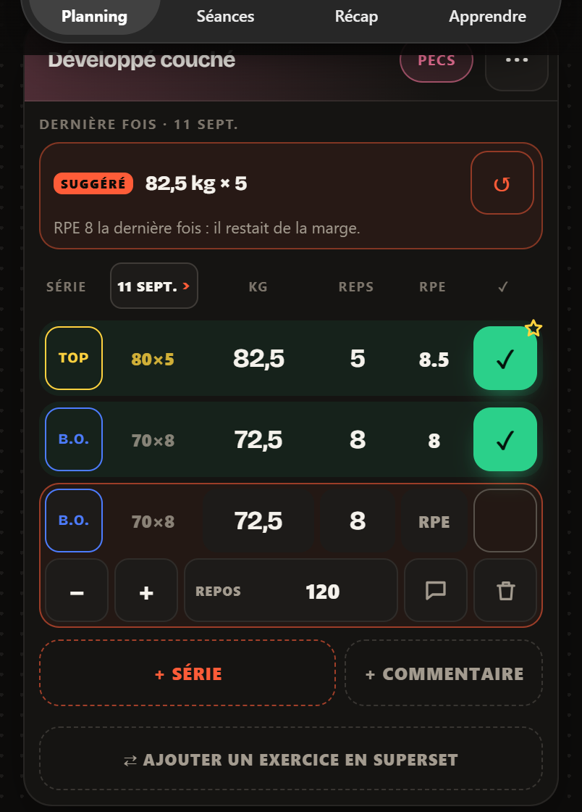
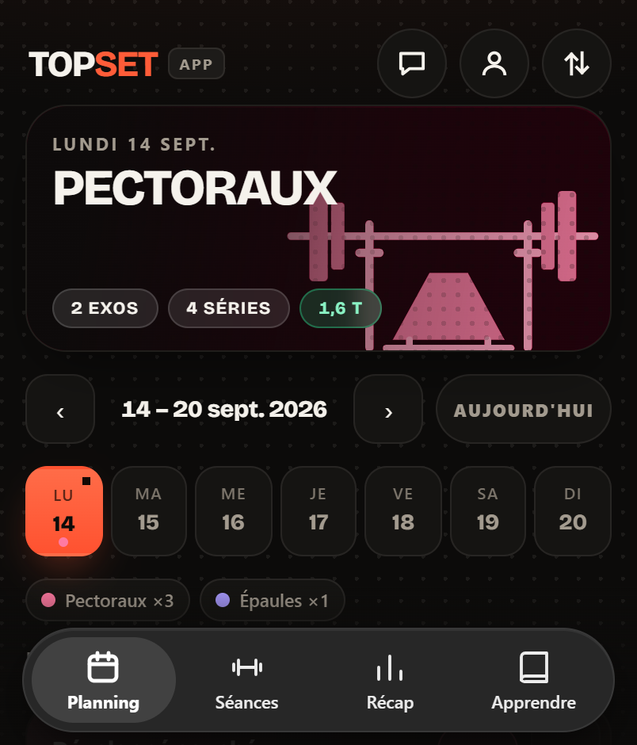

> [English](README.md) · **Français**


# top-set

**Note une série en dix secondes. Regarde ta progression se construire, mois après mois.**

[](https://github.com/flxYom/top-set/actions/workflows/ci.yml)

[](LICENSE)

Un carnet de musculation qui tourne entièrement dans le navigateur. Tu notes tes
séries, tes charges, tes répétitions et ton RPE pendant la séance ; il te rend le
volume, les records et la progression dans le temps.

Le compte est facultatif. Sans lui, tout vit dans le `localStorage` du
navigateur, sur l'appareil que tu utilises, et aucun serveur ne voit rien. Avec
lui, le carnet est en plus copié chez Supabase et te suit d'un appareil à
l'autre, et la messagerie s'ouvre : l'équipe, ton coach, tes coachés. Voir
[Tes données](docs/fr/donnees.md#où-vivent-tes-données).

**C'est une bêta**, utilisée et développée au jour le jour par son auteur. Attends-toi
à des aspérités et, de temps en temps, à un changement qui casse quelque chose. Si
un truc est cassé, confus ou manquant, [ouvre une issue](https://github.com/flxYom/top-set/issues/new/choose) —
c'est exactement à ça que sert ce repo pour l'instant.

<p align="center">
  
  
  
</p>
<p align="center"><sub>Planning · Saisie d'une série · Récap hebdomadaire — vrais écrans, avec des chiffres de démo pour ces captures.</sub></p>

---

## En bref

- **Noter vite, en séance.** L'app s'ouvre sur la séance du jour : une ligne par
  série (charge, répétitions, RPE, coche), le chrono des exercices au temps, le
  cardio (durée, vitesse, inclinaison), et le repos qui se compte tout seul.
- **Ne pas repartir de zéro.** Refaire la dernière fois, les exercices de la
  semaine d'avant, la charge suggérée.
- **Voir où on en est.** Un planning en calendrier (jour, semaine, mois), les
  séances prévues et l'historique, un bilan de fin de séance comparé à la même
  séance la semaine d'avant, le récap de la semaine, du mois et de l'année, la
  progression et les records de chaque exercice.
- **Garder la main sur ses données.** Hors-ligne, sans compte par défaut, export
  et import JSON ou tableur. Un compte facultatif synchronise le carnet d'un
  appareil à l'autre.
- **Être suivi.** Une messagerie avec l'équipe, et un lien coach ↔ coaché : le
  coach lit le carnet, en lecture seule, après accord des deux côtés.
- **Apprendre.** Des pages sourcées sur les notions, l'entraînement, les
  exercices, et des outils (calculateur de 1RM, tableau RPE, modèle de carnet).

## Documentation

| Document | Ce qu'on y trouve |
| --- | --- |
| [Fonctionnalités](docs/fr/fonctionnalites.md) | tout ce que fait l'app, écran par écran |
| [Tes données](docs/fr/donnees.md) | où elles vivent, la synchro, la sauvegarde, la migration, la confidentialité |
| [Coach et administration](docs/fr/coach-et-admin.md) | le lien coach ↔ coaché, la messagerie, les retours, l'espace admin |
| [Technique](docs/fr/technique.md) | la pile, la structure du projet, les comptes Supabase, le lancer, le déployer, l'installer |
| [Référencement](docs/fr/referencement.md) | les pages de contenu et le SEO |
| [Design system](docs/design/DESIGN_SYSTEM.md) | couleurs, typographie, règles d'interface, décisions closes |
| [Sécurité](.github/SECURITY.md) · [Contribuer](.github/CONTRIBUTING.md) · [Journal des modifications](CHANGELOG.md) | |

Le reste de `docs/` : la stratégie SEO (`docs/seo/`), les audits datés
(`docs/audits/`), la direction artistique (`docs/design/`) et les captures de ce
README (`docs/screenshots/`).

## Structure du dépôt

```
index.html  app.js  intelligence.js  sw.js    l'app
css/  icons/  img/  fonts/  vendor/           ce que l'app et les pages chargent
documentation/  entrainement/  exercices/  outils/  *.html
                                              pages du site (celles de contenu sont générées)
contenu/  scripts/                            source et générateur des pages de contenu
supabase/                                     schéma, RLS et ses tests
test/                                         tests de l'app et des pages
docs/  .github/                               documentation, CI, sécurité
```

Le détail fichier par fichier est dans [Technique](docs/fr/technique.md#structure-du-projet).

## Le lancer en local

Aucune étape de build, aucune dépendance à installer :

```bash
npx serve .
```

Les tests, tels que la CI les lance :

```bash
node test/intelligence.test.mjs && node test/gabarits.test.mjs && node test/liens.test.mjs && node scripts/contenu.mjs --verifier && node test/contenu.test.mjs
```

---

## Ce qu'il n'est pas

- **Pas un entraîneur automatique.** Il enregistre ce que tu as fait ; il ne te dit pas
  quoi faire.
- **Pas un dispositif médical.** Les charges et le RPE sont ceux que tu as saisis.
  Rien n'est vérifié, validé ni conseillé.
- **Pas une app sociale.** Pas de fil d'actualité, pas d'amis, pas de
  classement. On écrit à l'équipe, à son coach ou à ses coachés — à personne
  d'autre.

---

## La suite

**Livré :** les comptes optionnels et la synchronisation cloud sur Supabase, le
service worker et le hors-ligne, la logique métier testée dans `intelligence.js`,
la page de progression par exercice, les retours utilisateurs et l'espace
administrateur.

**Livré depuis :** le lien coach ↔ coaché (code d'invitation, accord des deux
côtés, consentement, révocation, lecture du carnet), la messagerie de support —
où chaque retour ouvre une conversation — et la conversation coach ↔ coaché,
réunies dans une seule boîte avec sa pastille ; les exercices au temps et leur
chrono ; le cardio (minutes, vitesse, inclinaison) ; l'import qui ajoute sans
remplacer, JSON comme tableur ; le profil et les données séparés.

**En cours :** des modèles de séance rangés en dossiers, assignables dans le
carnet d'un coaché, et un retour de séance. `profils` est le socle de tout ça —
c'est pour elle qu'elle a été écrite en premier.

**Encore ouvert :** le retour du lien de réinitialisation du mot de passe n'a
jamais été exercé avec un vrai email. Les enregistrements DNS de Resend sont
publiés sur `top-set.fr` et la clé API est branchée dans les réglages SMTP de
Supabase (d'après le propriétaire, 11 septembre 2026 — pas vérifié depuis le
dépôt) ; il reste à faire le tour complet.

---

## Licence

Tous droits réservés. Le code est public en lecture ; il n'est pas sous licence
de réutilisation.
